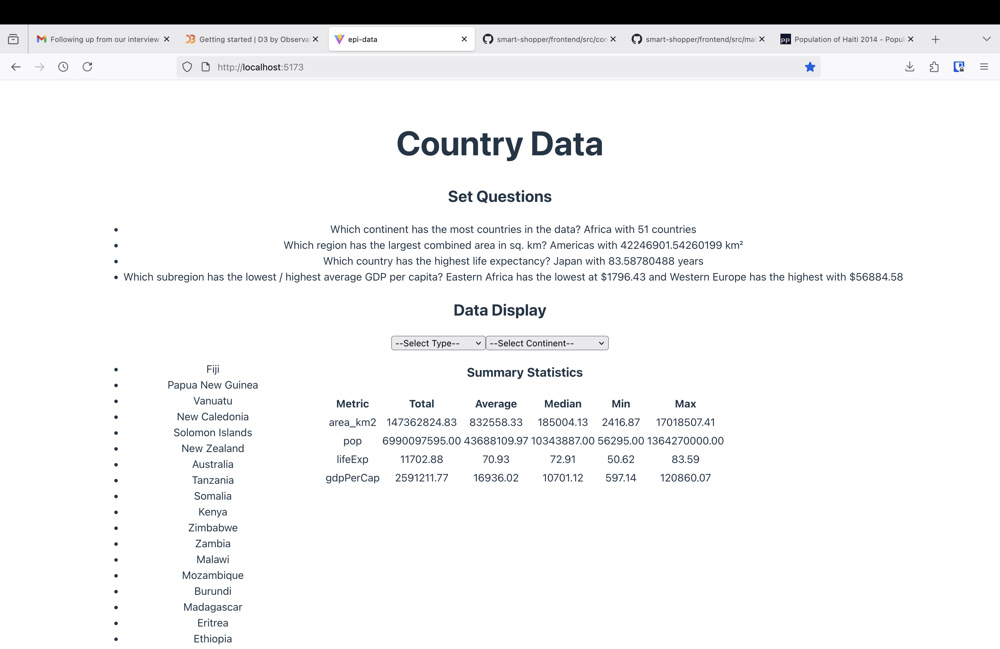

# EPI DATASET

- [Cleaning The Data](#cleaning-the-data)
- [Running The Code](#running-the-code)
- [Background Info](#background-info)

## Cleaning The Data

Before running the main code, you can see the dataset cleaned and preprocessed with the following command:

```sh
npm run clean
```

This will create a cleaned version named `worldData_clean.json` in the `data/` directory. If the file already exists, it will be overwritten with the new one.

_This command will also be run when using the dev command, so don't worry if you forget to run it before starting the project._

## Running The Code

To run the project, use the following commands:

```sh
npm install
npm run dev
```

This will start the development server on port 5173 and be available at [http://localhost:5173](http://localhost:5173)

This is what the site should look like:



## Background Info

- This project was generated using vite (React + Typescript) (I'm not using a db as it's a small static dataset, so we're going frontend only)
- I was considering whether the data file should be input to the site itself, but decided against it for now to keep things simple. That functionality can be added later if wanted
- Decided to do a straightforward clean using fs and manual string reading rather than using a csv module. Keeps project weight low, though might be harder to deal with more complex csvs that modules would deal with better
- Assumption here: Seems like all duplicates are full line duplicates and both are seen in a row. I was going to compare names, but I think all the line counts/ids are unique to the countries, and they immediately follow each other
- Unique lines == 179, but there are 177 unique country names. Some contain partial data that are filled in on the other lines
- To dealt with duplicates, I'm filling in data, but duplicates are still checked if the key is missing or invalid. If both lines have valid data for a key, the first line's data is kept and not overwritten
- For missing data, I'm keeping "#N/A" to indicate missing values in the cleaned csv, but null values in the json. This is to keep things simple and avoid empty cells that might be misread, however it means we need to convert while cleaning. It's more work being done during clean up, but makes it easier to just use the data later (rather than doing it at read) and what seems like so many extra loops aren't on that big a dataset and would need to happen later anyway. Could be better though
- While looking at filtering regions and subregions etc, I decided to build a data tree to make it easier to access the region data (as if we choose a continent, we can limit the regions available etc). It is heirachical and static data, so makes sense to structure it that way rather than having to process available lists with every user interaction
- I've decided the subregion filtering will only be available when a region is selected. This is to keep things simple and avoid having to deal with too many options at once. It makes sense for a user, but I thought being able to go straight to subregion from continent might be useful. Could be added later if wanted, but it would take time

## Stretch Goals

- Extract cleaning logic into a separate module for reuse
- Add testing to ensure cleaning is working as expected
- Add ability to upload custom datasets to analyze (limited to same format for now)
- Add ability to download cleaned dataset
- Add filtering by subregion when no region is selected
- Add filter selection from text
